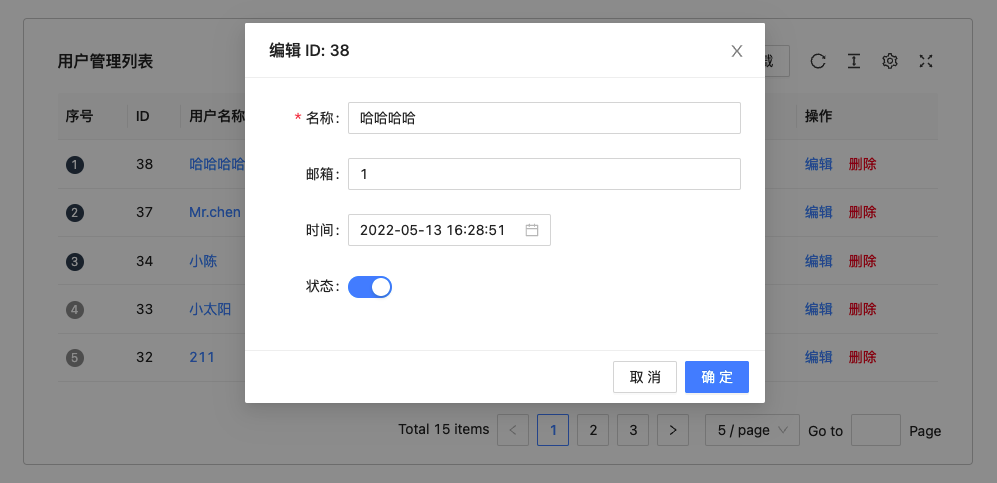

# 用户管理

## 先听我讲两句

- 技术栈：Umi3 + dva + antd + proTable + TypeScript

- 功能其实就是 CRUD，主要是学习 Umi3 和 dva 的项目开发流程

- 这是基于张立志老师在b站的免费课程学习后，自己慢慢实现的，因为要上班的缘故前前后后大概花费了两三天的时间，感兴趣的点击下面的链接访问学习即可，再次感谢张老师提供的课程！！！
- 对了，还想补充的一点是项目的后台服务，因为整体的业务逻辑流程并不复杂，所以我就直接使用 Node-RED 这个小工具实现了一下，目前不出意外的话应该还部署在我的个人服务器上（看心情，指不定啥时候停了）
- 接口代码部分在 src/pages/services 下，不要慌～ js 实现的，当然我也导出了一个 flows.json 文件，可以用于 Node-RED 直接导入使用

[张老师课程地址](https://www.aspirantzhang.com/dva3.html)

[Node-RED](https://nodered.org/)

## 快速开始

```bash
# 安装依赖
$ yarn

# 启动服务
$ yarn start
```

## 预览截图

### 用户列表


### 新增用户


### 编辑用户



### 删除用户


## 用户目录规划

### users

- index.tsx
- model.ts(妈斗)
- service.ts
- components/UserModal.tsx(摸斗)

## Dva

### 数据流概念

- 公共数据
- 私有数据
- 同步数据: Reducer 更改 state 的唯一渠道
- 异步数据: Effect

Redux Store State -> Model

- Subscription: 页面层级, 订阅
- 页面可以直接通过 connect 调用 Reducer 更改 state
- 也可以通过 dispatch(派发) Effect -> Reducer, 通过`put`函数
- Subscription 也可以通过 dispatch(派发) Effect

Effect 拆分

- Service: 服务

## antd

### Form

- initialValues: 只有初始化以及重置时生效,不能被 setState 动态更新,需要使用 setFieldsValue 更新

## proTable

```shell
npm i @ant-design/pro-table --save
# 或者
yarn add @ant-design/pro-table --save
```

## DatePicker 不能用作 JSX 组件

自己找找对应 @types/react 版本与 ts 版本依赖关系, 选择其一升级

https://www.npmjs.com/package/@types/react